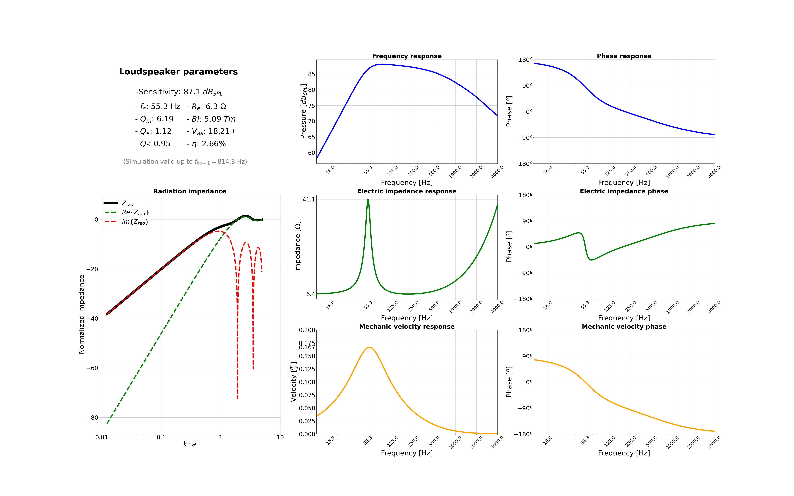

# Loudspeaker response simulation (free-field)
---
## **Description**
In a Electroacoustics course, a simulation was developed in Python that allows to study loudspeakers response in frequency, impedance and velocity with some Thiele-Small parameters as input. 

The notebook has six parts:

- **1. Libraries and auxiliar functions:** Loads the libreries needed (MatPlotLib and Numpy) and defines the Bessel and Struve functions requiered for describe the radiaton impedance of the air
- **2. Thiele-Small parameters:** Set the linear parameters of the loudspeaker. In fact, with only the electric resistance and inductance of the coil, the mechanical mass of the diaphragm, the mechanical compliance and resistance of the suspension, the 'Bl' factor and the effective diameter of the cone, the rest of parameters are calculated.
- **3. Transmission matrices:** Following the study and analysis of M. Lampton, the transmission matrices for the loudspeaker are calculated, so that the behavior of the whole system is fully described by these matrices, allowing to obtain the pressure response at the output and the electrical impedance response at the input.
- **4. Impedance response:** The magnitude of the electrical impedance response is calculated, as well as the phase of the electrical impedance. This procedure takes into account the transfer function of the system between the electric and acoustic world.
- **5. Frequency response:** The magnitude of the acoustic frequency response is calculated. This procedure takes into account the inverse transfer function of the system between the electric and acoustic world. The input voltage is 2.83 V, so the graph shows the sensitivity of the system.
- **6. Graphs:** The complete system response is shown, with the acoustic frequency response, the electrical impedance response, the mechanical velocity response and the air radiation impedance divided into the real and imaginary parts. The rest of the Thiele-Small parameters are also shown.

---
### **Library Requirements**
    numpy
    pyqt5
    matplotlib
--- 
